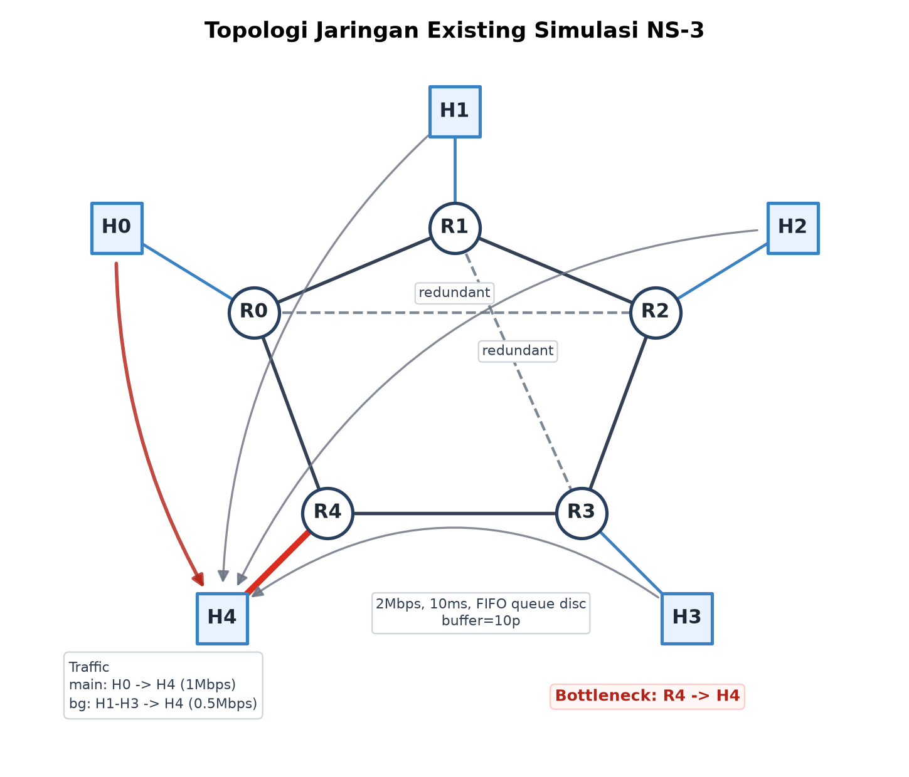
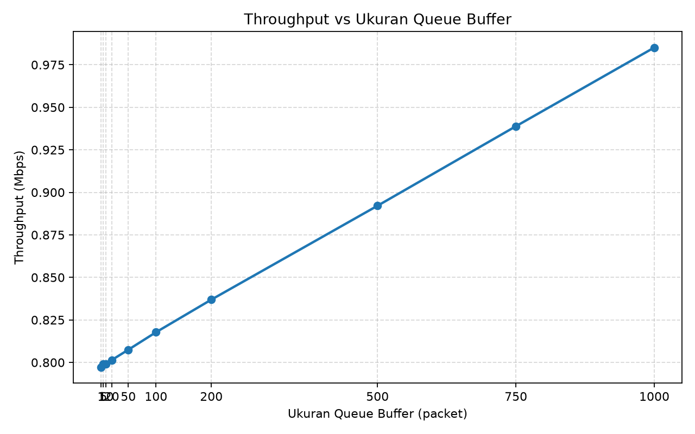
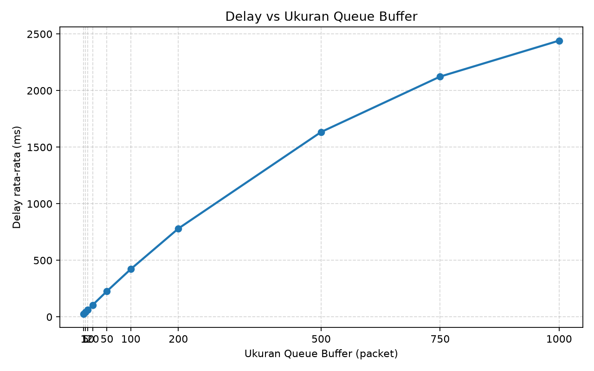
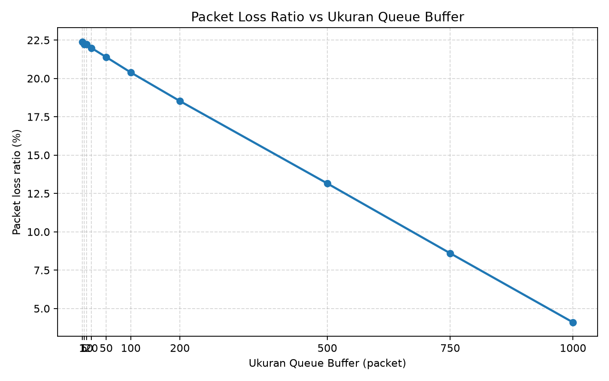
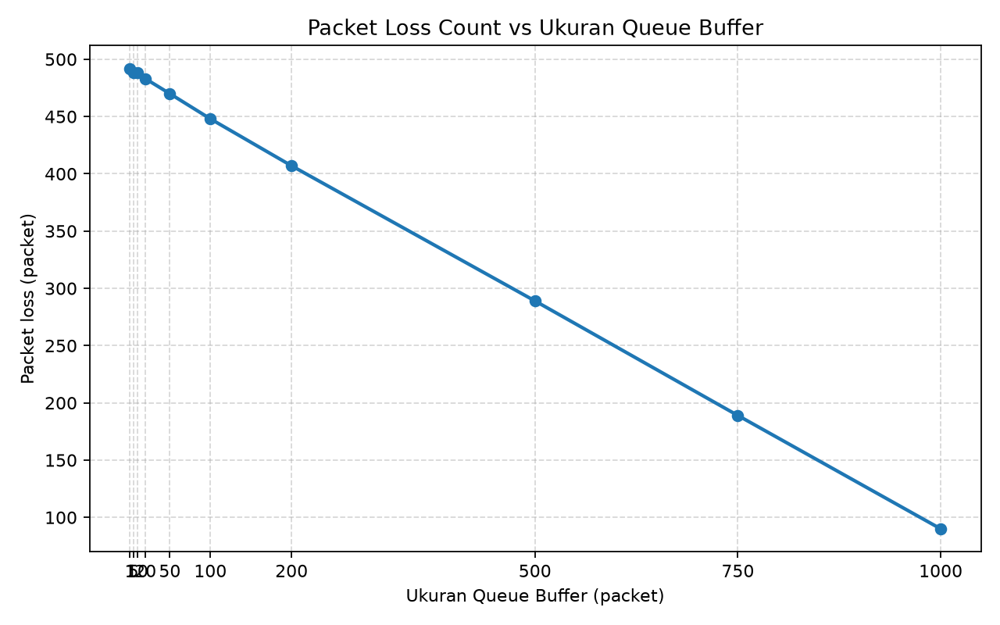
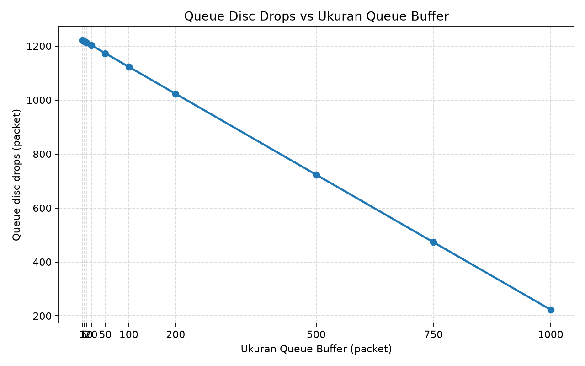
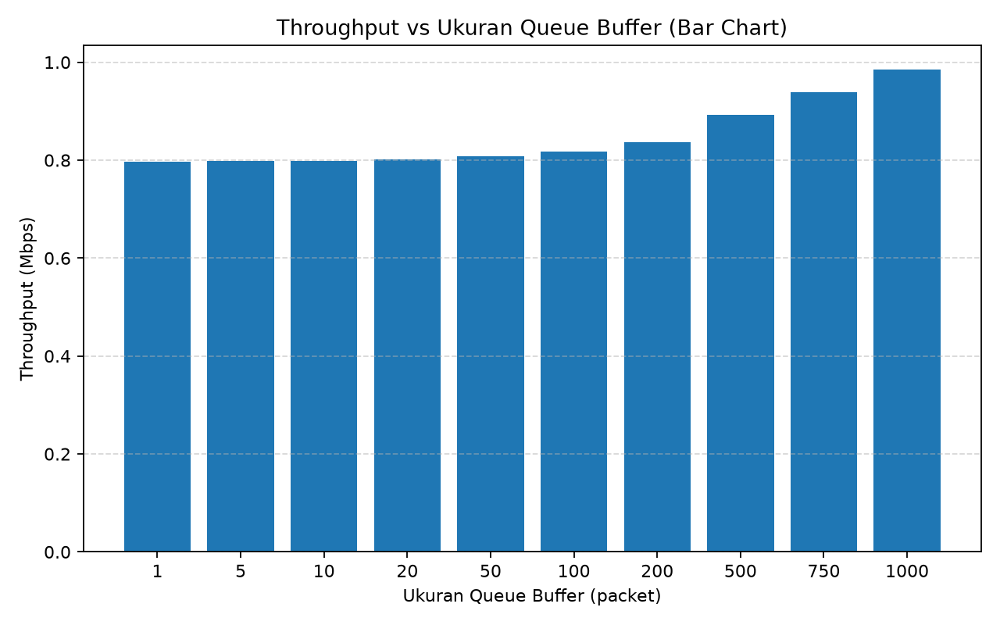
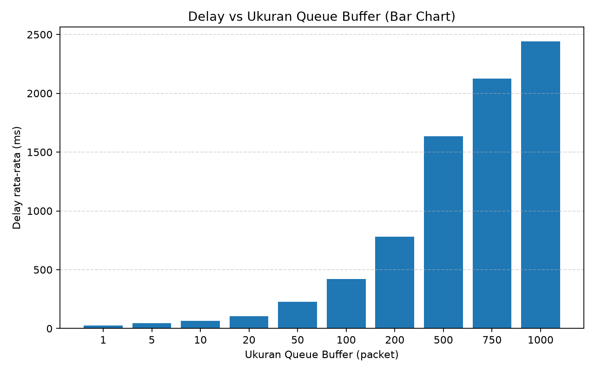
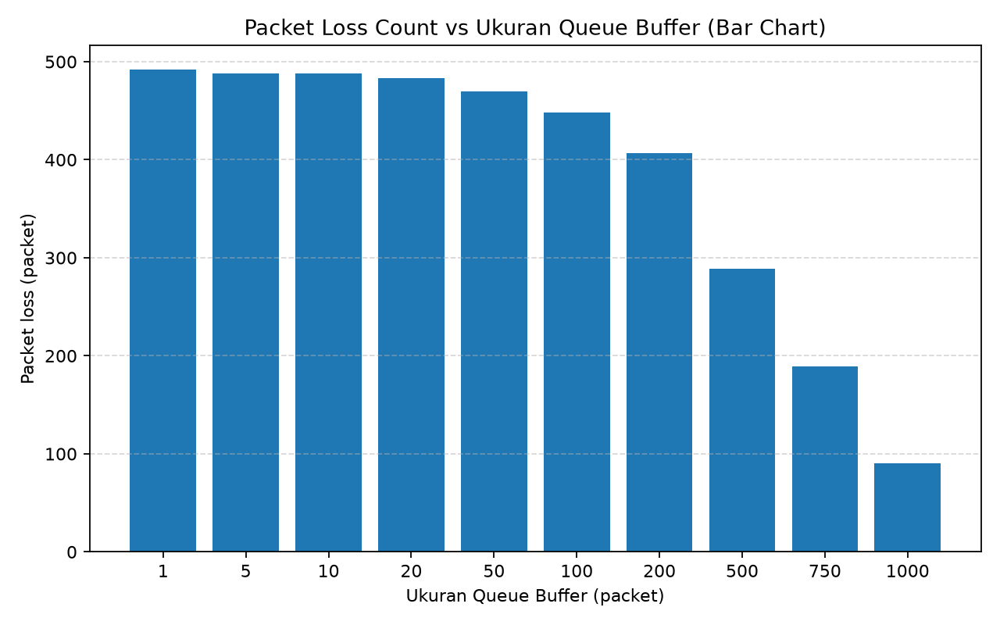
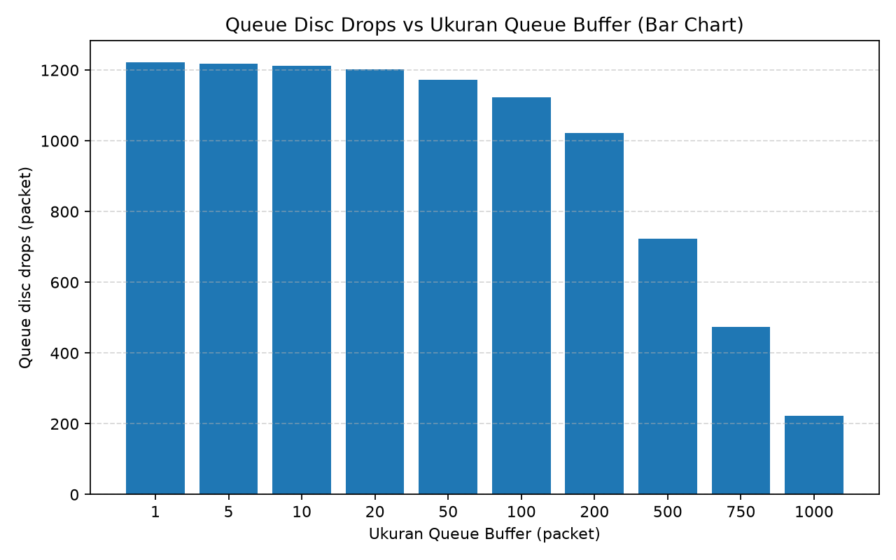

# Analisis QoS NS-3: variasi queue buffer

Proyek ini mensimulasikan pengaruh ukuran queue buffer terhadap QoS jaringan menggunakan NS-3. Variabel utama adalah ukuran `ns3::FifoQueueDisc` pada link bottleneck `R4 -> H4`. Metrik yang dicatat adalah throughput, delay rata-rata, packet loss, packet loss ratio, dan queue disc drops.

Judul penelitian:

Analisis Pengaruh Variasi Ukuran Queue Buffer terhadap Packet Loss, Throughput, dan Delay pada Topologi Jaringan Redundan Menggunakan NS-3.

## Struktur proyek

```text
.
|-- README.md
|-- requirements.txt
|-- src/
|   `-- queue_buffer_qos.cc
|-- scripts/
|   |-- run_experiments.py
|   |-- plot_results.py
|   `-- plot_topology.py
|-- tests/
|   `-- test_experiment_scripts.py
`-- results/
    |-- qos_results.csv
    |-- network_topology.png
    |-- throughput_vs_buffer.png
    |-- throughput_vs_buffer_bar.png
    |-- delay_vs_buffer.png
    |-- delay_vs_buffer_bar.png
    |-- packet_loss_ratio_vs_buffer.png
    |-- packet_loss_ratio_vs_buffer_bar.png
    |-- lost_packets_vs_buffer.png
    |-- lost_packets_vs_buffer_bar.png
    |-- queue_disc_drops_vs_buffer.png
    `-- queue_disc_drops_vs_buffer_bar.png
```

## Komponen

`src/queue_buffer_qos.cc` membangun topologi, memasang traffic UDP CBR, memasang queue disc bottleneck, menjalankan FlowMonitor, lalu menulis satu baris CSV untuk satu ukuran buffer.

`scripts/run_experiments.py` mengompilasi source NS-3 dengan `ns3-compile`, menjalankan semua sampel buffer untuk jumlah seed yang diminta, memvalidasi hasil, menulis `results/qos_results.csv`, lalu membuat grafik kecuali opsi `--skip-plots` dipakai.

`scripts/plot_results.py` membaca CSV dan membuat sepuluh grafik PNG: lima line chart dan lima bar chart. Jika eksperimen dijalankan dengan beberapa seed, nilai grafik dirata-ratakan per ukuran buffer.

`scripts/plot_topology.py` membuat visualisasi PNG topologi existing ke `results/network_topology.png`.

`tests/test_experiment_scripts.py` menguji daftar sampel buffer, pembentukan command, parsing CSV, validasi invariant metrik, validasi kolom `queue_disc_drops`, penolakan metrik flat, agregasi plot, dan pembuatan visualisasi topologi.

## Topologi

Simulasi memakai 5 router dan 5 host.



Host terhubung ke router masing-masing:

- `H0 -> R0`
- `H1 -> R1`
- `H2 -> R2`
- `H3 -> R3`
- `H4 -> R4`

Router membentuk loop `R0-R1-R2-R3-R4-R0` dengan link redundan `R0-R2` dan `R1-R3`. Semua flow menuju `H4` melewati link akses `R4 -> H4`, sehingga link tersebut menjadi bottleneck bersama.

Parameter link:

| Link                              | Data rate |  Delay | Device queue |
| --------------------------------- | --------: | -----: | -----------: |
| Host ke router, selain bottleneck | `100Mbps` |  `2ms` |     `10000p` |
| Router ke router                  |  `10Mbps` |  `5ms` |     `10000p` |
| Bottleneck `R4 -> H4`             |   `2Mbps` | `10ms` |         `1p` |

Queue disc yang diuji adalah `ns3::FifoQueueDisc` pada netdevice `R4 -> H4`. Device queue bottleneck dibuat `1p` agar antrean utama terjadi pada queue disc, bukan pada device queue.

## Variabel penelitian

Variabel bebas:

- Ukuran queue buffer `FifoQueueDisc` pada arah `R4 -> H4`.
- Sampel default: `1, 5, 10, 20, 50, 100, 200, 500, 750, 1000` packet.

Variabel terikat:

- `throughput_mbps`
- `average_delay_ms`
- `lost_packets`
- `packet_loss_ratio_percent`
- `queue_disc_drops`

Variabel kontrol:

- Topologi, bandwidth, delay, routing, packet size, durasi traffic, durasi simulasi, traffic rate, dan seed.

## Traffic dan waktu simulasi

Traffic memakai UDP CBR menuju `H4`.

| Flow                          | Rate default |   Port |
| ----------------------------- | -----------: | -----: |
| `H0 -> H4` sebagai flow utama |      `1Mbps` | `9000` |
| `H1 -> H4` sebagai background |    `0.5Mbps` | `9001` |
| `H2 -> H4` sebagai background |    `0.5Mbps` | `9002` |
| `H3 -> H4` sebagai background |    `0.5Mbps` | `9003` |

Total offered load default adalah `2.5Mbps` menuju bottleneck `2Mbps`. Kondisi ini membuat congestion ringan agar perubahan ukuran buffer terlihat pada loss dan delay.

Waktu default:

- Traffic mulai: `1s`
- Traffic berhenti: `19s`
- Simulasi berhenti: `25s`
- Durasi pengukuran throughput: `18s`

Simulasi sengaja berhenti setelah traffic selesai agar buffer besar punya waktu untuk drain sebelum statistik akhir dihitung. Jika `--simulationStop` dipakai, nilainya harus lebih besar dari waktu traffic stop.

## Metrik

FlowMonitor dipakai untuk mencari flow utama `H0 -> H4` berdasarkan alamat source, alamat destination, dan destination port `9000`.

Rumus metrik:

- Throughput Mbps = `rxBytes * 8 / 18 / 1_000_000`
- Delay rata-rata ms = `delaySum / rxPackets * 1000`
- Packet loss count = `txPackets - rxPackets`
- Packet loss ratio persen = `(txPackets - rxPackets) / txPackets * 100`
- Queue disc drops = drop count `FifoQueueDisc::LIMIT_EXCEEDED_DROP`

`queue_disc_drops` adalah metrik queue disc bottleneck untuk semua traffic yang melewati `R4 -> H4`. Metrik throughput, delay, dan packet loss dihitung untuk flow utama saja.

## Prasyarat

- Python 3.
- NS-3 dan helper `ns3-compile` tersedia di `PATH`.
- Dependensi Python dari `requirements.txt`.

Instal dependensi Python:

```bash
python -m pip install -r requirements.txt
```

## Cara menjalankan

Compile source simulasi:

```bash
ns3-compile src/queue_buffer_qos.cc -o build/queue_buffer_qos
```

Jalankan satu skenario:

```bash
./build/queue_buffer_qos --bufferPackets=10 --runSeed=1 --csvHeader=true
```

Jalankan semua sampel default dan buat grafik:

```bash
python scripts/run_experiments.py
```

Perintah default menjalankan 1 seed per ukuran buffer dan menghasilkan 10 baris data.

Jalankan beberapa seed per ukuran buffer:

```bash
python scripts/run_experiments.py --repetitions 3
```

Compile saja tanpa menjalankan eksperimen:

```bash
python scripts/run_experiments.py --compile-only
```

Jalankan eksperimen tanpa membuat grafik:

```bash
python scripts/run_experiments.py --skip-plots
```

Buat ulang grafik dari CSV yang sudah ada:

```bash
python scripts/plot_results.py
```

Buat ulang visualisasi topologi:

```bash
python scripts/plot_topology.py
```

## Opsi binary simulasi

Binary `build/queue_buffer_qos` menerima opsi berikut:

| Opsi                         |   Default | Keterangan                                                           |
| ---------------------------- | --------: | -------------------------------------------------------------------- |
| `--bufferPackets=<N>`        |      `10` | Ukuran `FifoQueueDisc` dalam packet. Nilai harus lebih besar dari 0. |
| `--runSeed=<N>`              |       `1` | Run number NS-3 untuk repetisi yang reproducible.                    |
| `--csvHeader=<true\|false>`  |   `false` | Cetak header CSV sebelum baris data.                                 |
| `--simulationStop=<seconds>` |      `25` | Waktu akhir simulasi. Harus lebih besar dari `19s`.                  |
| `--mainRate=<rate>`          |   `1Mbps` | Rate UDP CBR untuk flow utama `H0 -> H4`.                            |
| `--backgroundRate=<rate>`    | `0.5Mbps` | Rate setiap background flow menuju `H4`.                             |

## Output

`results/qos_results.csv` berisi kolom:

```text
buffer_packets,tx_packets,rx_packets,lost_packets,queue_disc_drops,packet_loss_ratio_percent,throughput_mbps,average_delay_ms,run_seed,flow_id
```

Grafik line chart yang dibuat:

- `results/throughput_vs_buffer.png`
- `results/delay_vs_buffer.png`
- `results/packet_loss_ratio_vs_buffer.png`
- `results/lost_packets_vs_buffer.png`
- `results/queue_disc_drops_vs_buffer.png`

Grafik bar chart yang dibuat:

- `results/throughput_vs_buffer_bar.png`
- `results/delay_vs_buffer_bar.png`
- `results/packet_loss_ratio_vs_buffer_bar.png`
- `results/lost_packets_vs_buffer_bar.png`
- `results/queue_disc_drops_vs_buffer_bar.png`

Grafik memakai rata-rata per `buffer_packets` jika CSV berisi lebih dari satu `run_seed` untuk ukuran buffer yang sama.

Visualisasi topologi:

- `results/network_topology.png`

## Hasil saat ini

Output yang tersimpan di `results/qos_results.csv` dibuat dengan:

```bash
python scripts/run_experiments.py --repetitions 10
```

CSV saat ini berisi 100 baris: 10 ukuran buffer dikalikan 10 seed. Grafik di `results/` sudah dibuat ulang dari CSV tersebut dan memakai rata-rata per ukuran buffer. Ringkasan nilai rata-rata ekstrem:

| Buffer | Queue disc drops | Lost packets | Packet loss ratio |      Throughput |  Delay rata-rata |
| -----: | ---------------: | -----------: | ----------------: | --------------: | ---------------: |
|    `1` |           `1222` |        `492` |      `22.394174%` | `0.797182 Mbps` |   `26.381596 ms` |
| `1000` |            `223` |         `90` |       `4.096495%` | `0.985140 Mbps` | `2441.509905 ms` |

Pada output 10 repetisi saat ini, setiap seed menghasilkan nilai yang sama karena traffic memakai konstanta dan tidak ada proses acak yang memengaruhi pola paket. Buffer yang lebih besar menurunkan queue disc drops dan packet loss, sedikit menaikkan throughput, tetapi menaikkan delay rata-rata. Pola ini sesuai dengan trade-off buffer: loss turun karena antrean lebih besar, sedangkan delay naik karena paket menunggu lebih lama.

## Validasi

Jalankan unit test:

```bash
python -m unittest tests/test_experiment_scripts.py -v
```

Jalankan verifikasi eksperimen penuh:

```bash
python scripts/run_experiments.py
```

Validasi di runner akan gagal jika:

- Jumlah baris tidak sesuai `len(BUFFER_SAMPLES) * repetitions`.
- Ada pasangan `buffer_packets` dan `run_seed` yang hilang atau duplikat.
- Kolom wajib tidak ada.
- `tx_packets <= 0`.
- `rx_packets` di luar rentang `0..tx_packets`.
- `lost_packets` tidak sama dengan `tx_packets - rx_packets`.
- `packet_loss_ratio_percent` tidak sesuai dengan packet count.
- Throughput, delay, atau queue disc drops bernilai negatif.
- `flow_id <= 0`.
- `queue_disc_drops` atau `average_delay_ms` flat pada semua ukuran buffer.

## Catatan interpretasi

Throughput dihitung dari byte yang diterima selama durasi traffic aktif, yaitu `18s`, bukan dari total durasi simulasi `25s`. Sisa waktu setelah `19s` dipakai untuk memberi kesempatan antrean besar mengosongkan paket sebelum statistik akhir diambil.

Jika traffic rate atau queue discipline diubah, ulangi verifikasi penuh. Untuk mempertahankan bentuk eksperimen saat ini, offered load perlu tetap sedikit lebih besar dari kapasitas bottleneck `2Mbps` agar efek buffer tidak hilang atau menjadi terlalu ekstrem.

## Visualisasi hasil

### Line chart











### Bar chart









